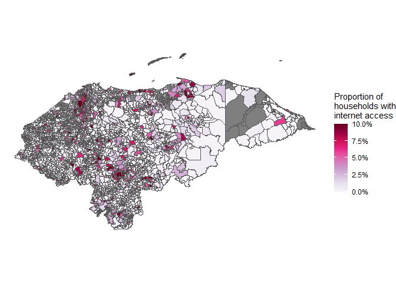
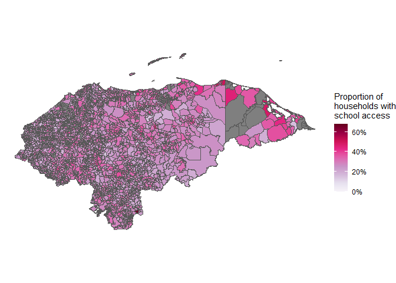

COVID Education Access
================
2020-09-03

  - [Honduras](#honduras)
      - [Internet access](#internet-access)
      - [School access](#school-access)

``` r
# Libraries
library(scales)
library(tidyverse)
library(sf)
library(DT)

# Parameters
df_internet <- read_sf(here::here("data/internet", "H08_INTERNET.shp"))
df_school <- read_sf(here::here("data/school", "P10_STUDENT.shp"))
```

# Honduras

## Internet access

``` r
df_internet
```

    ## Simple feature collection with 3732 features and 7 fields
    ## geometry type:  MULTIPOLYGON
    ## dimension:      XY
    ## bbox:           xmin: -89.35661 ymin: 12.98487 xmax: -83.14955 ymax: 16.51863
    ## geographic CRS: WGS 84
    ## # A tibble: 3,732 x 8
    ##    CODE  NAME  Shape_Leng Shape_Area   H69   H70   H14                  geometry
    ##    <chr> <chr>      <dbl>      <dbl> <dbl> <dbl> <dbl>        <MULTIPOLYGON [°]>
    ##  1 1102~ Mang~     0.268    0.00151     65   190   255 (((-85.86456 16.51259, -~
    ##  2 1102~ East~     0.0538   0.000121    10    21    31 (((-85.83453 16.48787, -~
    ##  3 1103~ Isla~     0.119    0.000432     0    26    26 (((-86.14931 16.4463, -8~
    ##  4 1103~ Punt~     0.101    0.000330    94   358   452 (((-86.37421 16.41376, -~
    ##  5 1103~ Cala~     0.112    0.000221    29    86   115 (((-86.33643 16.40119, -~
    ##  6 1103~ Poll~     0.0454   0.000103    26   112   138 (((-86.39617 16.40452, -~
    ##  7 1103~ Six ~     0.204    0.00116     31   366   397 (((-86.39617 16.40452, -~
    ##  8 1103~ Jone~     0.152    0.000382    14    45    59 (((-86.38359 16.39772, -~
    ##  9 1101~ Craw~     0.175    0.000858    16   162   178 (((-86.45226 16.377, -86~
    ## 10 1101~ Coro~     0.201    0.000890    23   189   212 (((-86.51286 16.3553, -8~
    ## # ... with 3,722 more rows

``` r
df_internet %>%
  mutate(
    internet_access = H69 / H14,
    internet_access = pmin(internet_access, 0.10)
    ) %>%
  ggplot(aes(fill = internet_access)) +
  geom_sf(size = 0.3) +
  scale_fill_gradientn(
    colors = RColorBrewer::brewer.pal(n = 9, name = "PuRd"),
    labels = percent
  ) +
  theme_void() +
  labs(
    fill = "Proportion of\nhouseholds with\ninternet access"
  )
```

<!-- -->

## School access

``` r
df_school
```

    ## Simple feature collection with 3732 features and 7 fields
    ## geometry type:  MULTIPOLYGON
    ## dimension:      XY
    ## bbox:           xmin: -89.35661 ymin: 12.98487 xmax: -83.14955 ymax: 16.51863
    ## geographic CRS: WGS 84
    ## # A tibble: 3,732 x 8
    ##    CODE  NAME  Shape_Leng Shape_Area   H69   H70   H14                  geometry
    ##    <chr> <chr>      <dbl>      <dbl> <dbl> <dbl> <dbl>        <MULTIPOLYGON [°]>
    ##  1 1102~ Mang~     0.268    0.00151    435   492   927 (((-85.86456 16.51259, -~
    ##  2 1102~ East~     0.0538   0.000121    37    94   131 (((-85.83453 16.48787, -~
    ##  3 1103~ Isla~     0.119    0.000432    31    60    91 (((-86.14931 16.4463, -8~
    ##  4 1103~ Punt~     0.101    0.000330   681   982  1663 (((-86.37421 16.41376, -~
    ##  5 1103~ Cala~     0.112    0.000221   131   250   381 (((-86.33643 16.40119, -~
    ##  6 1103~ Poll~     0.0454   0.000103   156   331   487 (((-86.39617 16.40452, -~
    ##  7 1103~ Six ~     0.204    0.00116    544   986  1530 (((-86.39617 16.40452, -~
    ##  8 1103~ Jone~     0.152    0.000382    66   149   215 (((-86.38359 16.39772, -~
    ##  9 1101~ Craw~     0.175    0.000858   263   430   693 (((-86.45226 16.377, -86~
    ## 10 1101~ Coro~     0.201    0.000890   303   576   879 (((-86.51286 16.3553, -8~
    ## # ... with 3,722 more rows

``` r
df_school %>%
  mutate(
    school_access = H69 / H14
    ) %>%
  ggplot(aes(fill = school_access)) +
  geom_sf(size = 0.3) +
  scale_fill_gradientn(
    colors = RColorBrewer::brewer.pal(n = 9, name = "PuRd"),
    labels = percent
  ) +
  theme_void() +
  labs(
    fill = "Proportion of\nhouseholds with\nschool access"
  )
```

<!-- -->
